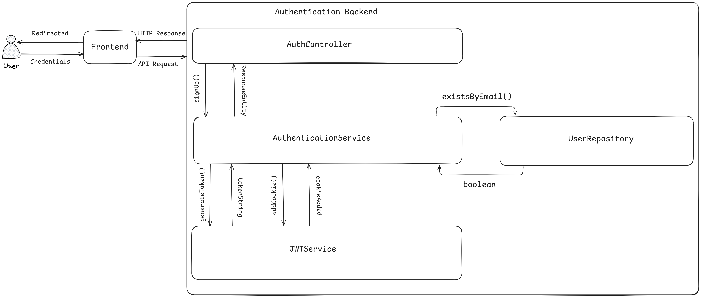

# BetterProducts - Sign up

## Overview

This is a detailed explanation about how a user would sign up to the BetterProducts application. It explains the entire
roadmap taken from the request until the response step by step. For any change to the workflow of signing up, this file
will also be changed to present the most up-to-date version of the process.

## Detailed Explanation

After a request with all the necessary information is made from the frontend using the url
https://betterproductivity/auth/signup.com, the user sends the necessary information to AuthController. The information has to
contain the user's username, email and password as a JSON formatted string. The credentials are then sent to the AuthenticationService
class where further processing is done. In the AuthenticationService class, the first thing checked is if the user's provided
email is valid. If the user's email is invalid an InvalidEmailException is thrown. When the provided email is valid,
the next part of validation is to check if a user with the same email already exists. This is done so that there are no two
users with the same email. If a user with the same email is found then an UserAlreadyExistsException is throw. After it
is asserted that a user with the same email does not exist the UserDTO is converted into an UserModel and saved. Finally,
a ResponseEntity with the HTTPStatus code 201/Created and body with the content "User created successfully.".

<picture>
<source media="(prefers-color-scheme: dark)" srcset="../Images/SignUpDark.png">
<source media="(prefers-color-scheme: light)" srcset="../Images/SignUpLight.png">

</picture>